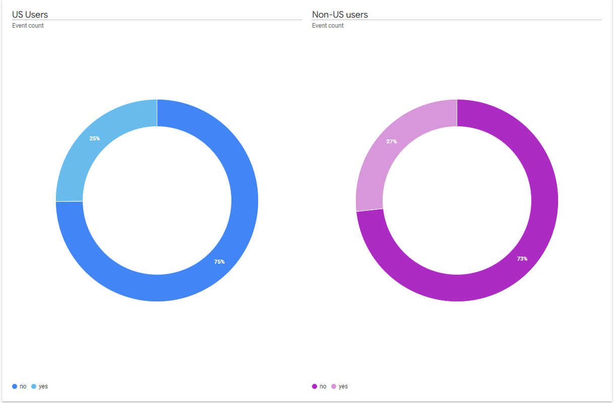
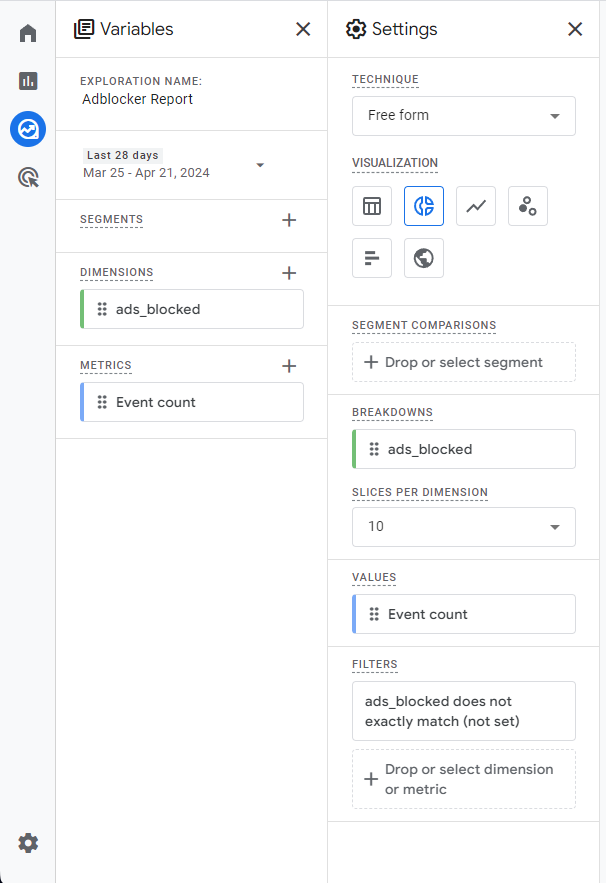
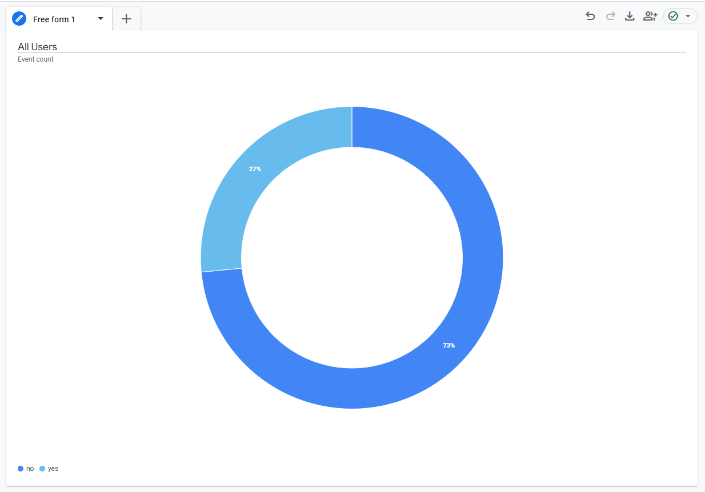

# Adblock Detector
A simple js script that detects if AdBlock is enabled on your webapp.

[Test the script on this page](https://husnaintaj.github.io/adblock-detector)

# How it works
The script tries to fetch three most common ad scripts found in one of the most popular filter list, [Easy List](https://easylist.to/easylist/easylist.txt), used by AdBlockers.


```js
// script.js
(async function() {
    try
    {
        await fetch('/_prebid.js');
        await fetch('/ad_common.js');
        await fetch('/ad_code.js');
       
        // if the codes reaches here, it means all the fetch calls were successful
        console.log("Adblock Not Active.");
    }
    catch (error)
    {
        // At least one fetch call failed
        console.log("Adblock Detected.");
    }
})();
```

# Sample Google Analytics Integration

This script can be used with Google Analytics to estimate AdBlock usage rate of your website's visitors. 



Following will show a basic integration of this script with Google Analytics for reporting and visualization.

## 1. Sending the Event

Add this script on your website, it will send a custom event called `adsblocked` with a value of `yes` or `no` on page load.

> You can find this script in `script-ga.js`

```js
// script-ga.js
(async function() {
    try
    {
        await fetch('/_prebid.js');
        await fetch('/ad_common.js');
        await fetch('/ad_code.js');
       
        // if the codes reaches here, it means all fetch calls were successful
        console.log("Adblock Not Active.");
        
        gtag('event', 'adsblocked', {
            'value': "no"
        });
    }
    catch (error)
    {
        // At least one fetch call failed
        console.log("Adblock Detected.");

        gtag('event', 'adsblocked', {
            'value': "yes"
        });
    }
})();
```

> Note: It can sometimes take Google Analytics a while to register your event after it is sent for the first time before its value is visible in Custom Definition creation window, So take a break and come back later.

## 2. Creating Custom Dimension

On Google Analytic's Page, click on the settings icon at bottom of the left sidebar.

Inside the side menu on the left, Go to `Property Settings` > `Data display` > `Custom definitions`

Create a custom dimension with Name = `ads_blocked`, Scope = `Event`, Event parameter = `value` and Description can be left blank.

> Note: Again, it can take Google Analytics some time to process your new Custom Definition and its data may not be visible in reports right away. So, take a break and come back the next day to continue setup.

## 3. Creating the Report

On Google Analytic's Page, click on `Explore` in the sidebar.

Create a new Exploration and configure it as shown in the screenshot below:



If enough data has been collected, you will see a chart like this:



You can further create `Segments` to see adblock usage for a specific demographics etc., but I'll let you figure that out for yourself.

# Contributing
Improvements to this readme or the scripts while maintaining their simplicity are welcome.

# License
The project is available as open source under the terms of the [MIT License](http://opensource.org/licenses/MIT).